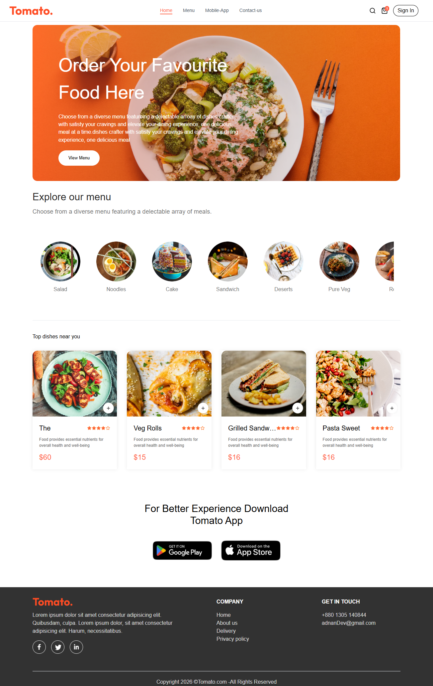
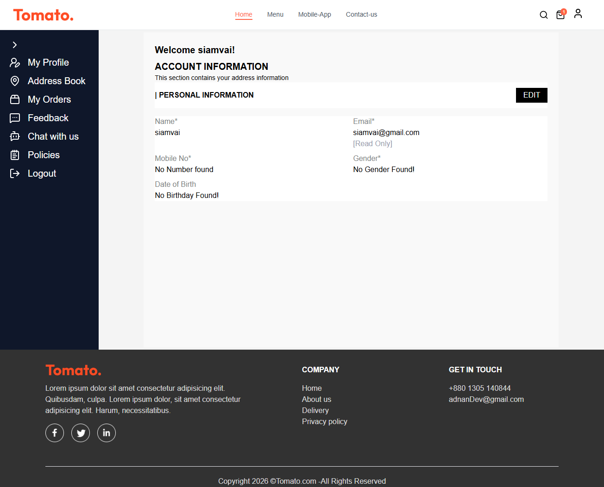
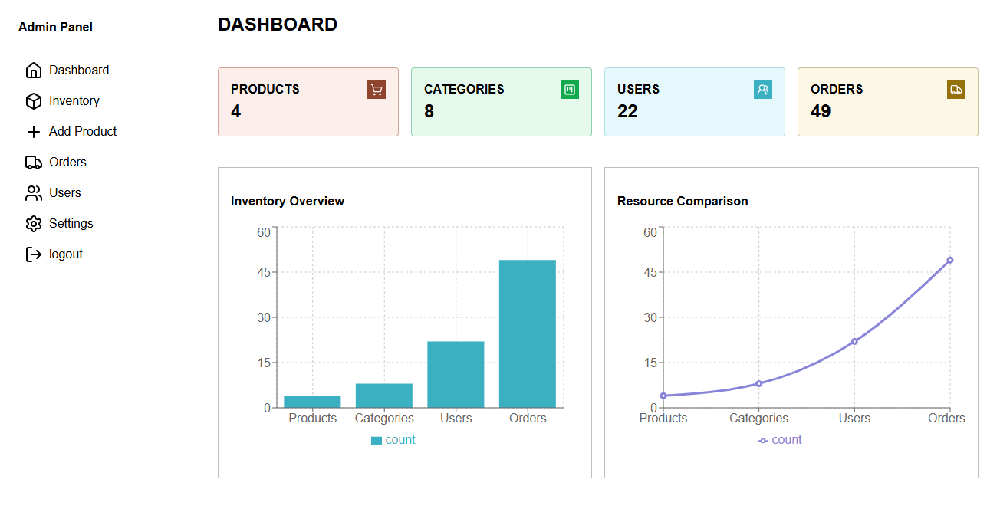

# 🚀 Project Name

Project description-->>>

## ✨ Features
- ✅ User Authentication (Firebase/JWT)
- ✅ Responsive UI with Tailwind CSS
- ✅ Smooth Animations (Raw Css)
- ✅ Firebase Firestore(Database)
- ✅ Redux Toolkit(States Management)

## 🛠️ Tech Stack
- **Frontend:** React, Redux Toolkit
- **Database:** Firebase
- **Auth:** Firebase Authentication

## ⚙️ Installation

১. রিপোজিটরি ক্লোন করুন:
bash
git clone (https://github.com/freelanceradnan/tomato-ecommerce-projects.git)

২. ডিপেন্ডেন্সি ইন্সটল করুন:
bash
npm install

৩. এনভায়রনমেন্ট ভেরিয়েবল (.env) সেটআপ করুন এবং অ্যাপ রান করুন:
bash
npm run dev

## 📸 Screenshots

## 👤 Author
_Adnan Dev.
